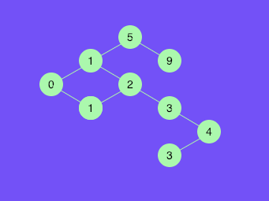

# My Coding Challenge 

This is my weekly coding challenge from [The Coding Train]( https://www.youtube.com/channel/UCvjgXvBlbQiydffZU7m1_aw)'s  tutorials with `p5.js`

## Binary tree visualzation

#### Videos

[Coding Challenge #65.2: Visualizing a Binary Tree](https://youtu.be/ZNH0MuQ51m4),

[Coding Challenge #65.2: Visualizing a Binary Tree](https://youtu.be/KFEvF_ymuzY)

#### Demo

[link](https://skyying.github.io/coding-challenge/dist/index.html)

